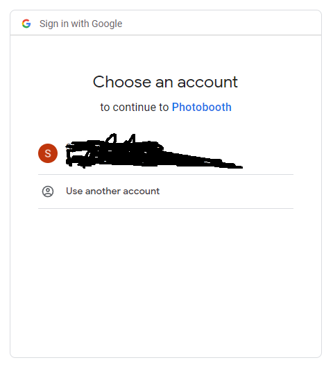
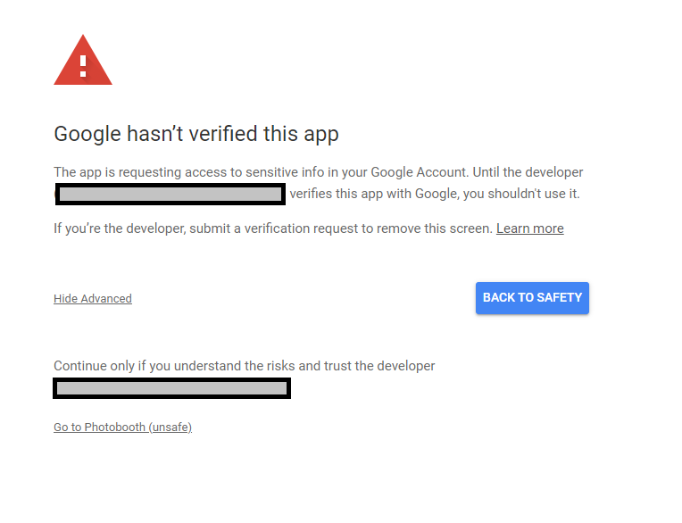
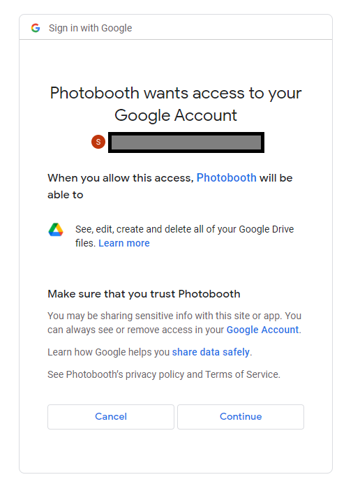

# Photobooth
The Photobooth application is an application that consist of 2 parts: 

1. `backend.py` - This will be the application that will upload a specified folder onto Google Drive. The batch number will be tracked for this application.
2. `sender.py` - This will get all the photos from the Google Drive based on the batch number and send it to the user's specified phone number via Telegram. 

## Installation
**Google Client Library** and **Twilo** is required for this project. You may install it by doing the following.

`python.exe -m pip install --upgrade google-api-python-client google-auth-httplib2 google-auth-oauthlib`

`python.exe -m pip install twilio`

**credentials.json** and **twilo_creds.json** are required for this project. You may get them from the developer. They should be placed in the home directory of the project. 

## Quick Start
1. Clone the project onto your computer. 
2. Run the sender/backend.py application.
3. **[For first run]** You will run into a prompt as shown below. Select the relevant Google Account. 

4. **[For first run]** It will say that Google has not verified the app. Click on *Advanced* and *Go to Photobooth (unsafe)*

5. **[For first run]** Click on *Continue* to allow for access 

6. **[For first run]** `token.json` will be created and there will be no need for Steps 3 to 6

## Referenced Links
- https://developers.google.com/drive/api/quickstart/python